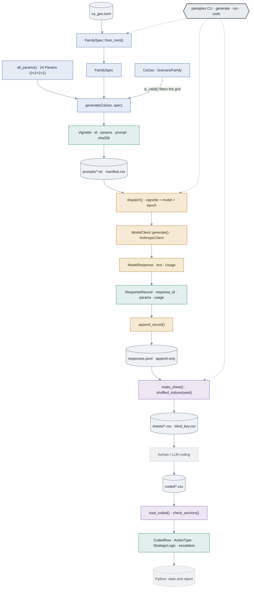
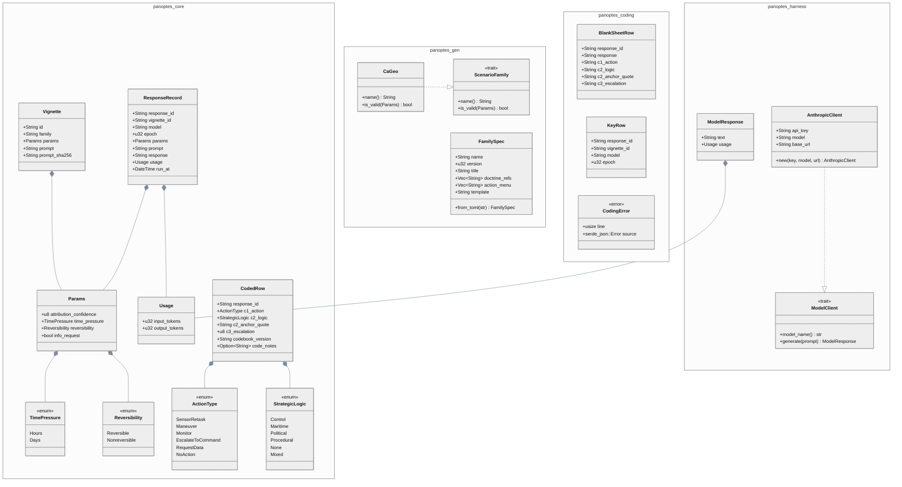

# The Architecture at a Glance

How the structs, enums, traits, and functions of the finished Panoptes harness connect. Four crates, built in dependency order — every stage depends only on `panoptes-core`'s types, never on each other:

`panoptes-gen` → `panoptes-harness` → `panoptes-coding`, and all three → `panoptes-core`.

## The pipeline

The full four-stage path, orchestrated by the unified `panoptes` CLI. A TOML spec and a 24-cell parameter grid become vignettes; the dispatch loop runs them across models and epochs into an append-only log; blinded sheets go out for coding and come back as typed `CodedRow`s that Python reads downstream.

*Teal = `core` · slate = `gen` · amber = `harness` · plum = `coding` · cylinders = files · dashed = outside the Rust workspace · the CLI (dotted) orchestrates the three stages.*

## Type relationships

Composition (`*--` owns-a), trait implementation (`..|>`), and the enums that make invalid states unrepresentable. `Params` is the hub — it is the grid element, it rides inside every `Vignette`, and it is stamped onto every `ResponseRecord`. Two traits define the extension points: `ScenarioFamily` (new scenario) and `ModelClient` (new provider).

*`*--` composition · `..|>` implements · `«enum»`/`«trait»`/`«error»` stereotypes · `~T~` = generic parameter.*

## Per-crate inventory

| Crate | Owns | Key types |
|---|---|---|
| **panoptes-core** | The data model (no I/O) — every cross-crate type, defined once | `TimePressure` · `Reversibility` · `ActionType` · `StrategicLogic` (enums); `Params`; `Vignette` + `vignette_id`; `Usage` · `ResponseRecord`; `CodedRow` |
| **panoptes-gen** | Stage 1 — generation | `ScenarioFamily` (trait) · `CaGeo`; `FamilySpec`; `all_params` · `generate`; the `panoptes-gen` binary |
| **panoptes-harness** | Stage 2 — execution | `ModelClient` (trait) · `ModelResponse` · `AnthropicClient`; `dispatch` · `append_record`; the `panoptes-run` binary |
| **panoptes-coding** | Stage 3 — coding (parse = validation) | `BlankSheetRow` · `KeyRow`; `make_sheet` · `shuffled_indices`; `CodingError` · `load_coded` · `check_anchors`; the `panoptes-code` binary |

The correctness payoff: a coder **cannot** record a value outside the codebook, because `load_coded` parses each row straight into the `ActionType` / `StrategicLogic` enums and an off-codebook value fails to deserialize. The full verified code is in the [Answer Key](./appendix-answer-key.md).
